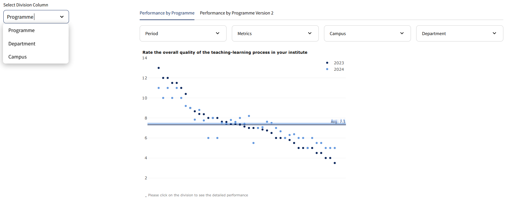
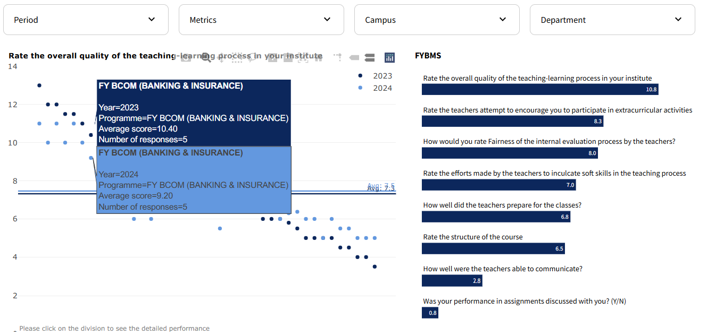
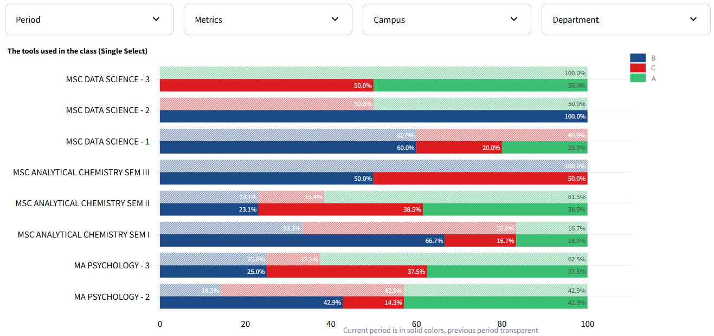

# PoC Dashboard

The PoC Dashboard was developed using Streamlit to provide a dynamic and interactive platform for visualizing and analyzing performance metrics for different surveys. The goal was to create a template dashboard that effectively visualizes survey data and can be easily applied for multiple industries. The dashboard focuses on displaying initially high level data, and giving the user the option to intuitively segment their data, making complex data easily understandable.

## Features

- **Dynamic Metric Selection**: Users can choose specific metrics to analyze from a sidebar, allowing for personalized data exploration based on selected performance indicators.
- **Average Score Visualization**: The dashboard prominently displays the average score of specific metrics across all divisions, providing a clear overview of overall performance.
- **Cross-division Comparison**: Users can view and compare scores across different divisions.
- **Deviation from Average**: It visualizes how performance deviates from the overall average, highlighting outliers and exceptional performers.
- **Historical Data Analysis**: The dashboard includes functionalities to compare current results against historical data, allowing users to track progress and trends over time.
- **Deep Dive Analytics**: Advanced filters and interactive charts enable users to delve deeper into the data, examining specific aspects of performance in detail.
- **Versatile Question Types**: The app accepts surveys with various types of questions, including:
  - **Numeric and Yes/No Questions**: Displayed as scatter plots to indicate average metrics, facilitating quick assessments of program standings.
  - **Single and Multi-Select Questions**: Visualized using stacked bar charts that show the distribution of responses, providing a detailed breakdown of participant preferences and opinions.

## Examples

Here is a practical examples of how to use the dashboard:

1. Select the field you want to analyze from a sidebar.
2. Select the desired period from the "Period" filter.
3. Choose a metric/question from the "Metrics" dropdown.
4. Select the other filters.
5. View the performance metrics in the scatter plot or the bar chart (depending on the type of metric).
6. Click on dots to see detailed performance metrics in the bar chart.







## Installation

1. Clone the repository:
   ```sh
   git clone https://github.com/ninoperanidze/PoC_Dashboard.git
   cd PoC_Dashboard

2. Create and activate a virtual environment:
   ```sh
    python -m venv .venv
    .venv\Scripts\activate  # On Windows
    source .venv/bin/activate  # On macOS/Linux

3. Install the required packages:
   ```sh
    pip install -r requirements.txt

4. Run the Streamlit app:
   ```sh
    streamlit run app.py


## Requirements

- Python 3.11
- The required packages are listed in the `requirements.txt` file. They include:
  - `streamlit`
  - `pandas`
  - `plotly`
  - `streamlit-plotly-events`


## File Structure

- `app.py`: The main application file containing the Streamlit code and chart configurations.
- `data_cleaned_dummy.xlsx`: The dataset containing all typed of data: numric, yes/no, single select and multi select questions.
- `requirements.txt`: The file listing the required packages for the project.
- `.streamlit/config.toml`: The configuration file for Streamlit settings.

## License

This project is licensed under the MIT License. See the LICENSE file for more details.
