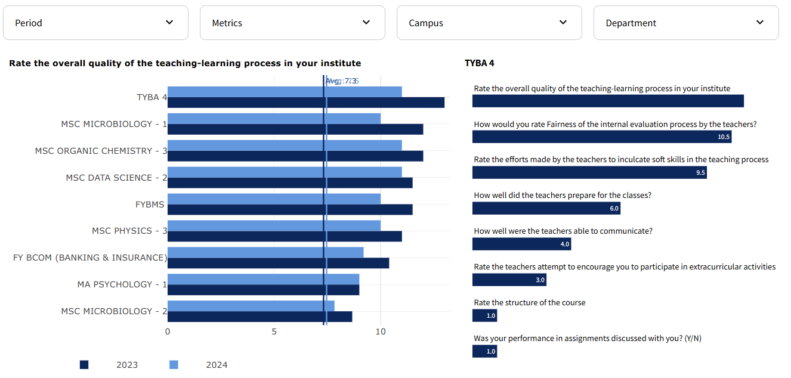

# Samba Soccer Schools Dashboard

This project is a web application built with Streamlit to visualize and analyze performance metrics for Samba Soccer Schools. The dashboard allows users to filter and view performance data by class and age group, and interact with the charts to see detailed performance metrics.


## Features

- **Performance by Class**: View and analyze performance metrics for different classes.
- **Performance by Age Group**: View and analyze performance metrics for different age groups.
- **Interactive Charts**: Click on the charts to see detailed performance metrics for selected classes or age groups.
- **Customizable Filters**: Filter data by period, metrics, membership period, and class.


## Examples

Here are some practical examples of how to use the dashboard:

### Example 1: Viewing Performance by Class
1. Select the desired period from the "Period" filter.
2. Choose a metric from the "Metrics" dropdown.
3. Select the membership period and age group.
4. View the performance metrics for different classes in the scatter plot.
5. Click on a class to see detailed performance metrics for the selected class in the bar chart.


### Example 2: Viewing Performance by Age Group
1. Navigate to the "Performance by Age Group" tab.
2. Select the desired period from the "Period" filter.
3. Choose a metric from the "Metrics" dropdown.
4. Select the membership period and class.
5. View the performance metrics for different age groups in the column chart.
6. Click on an age group to see the top 10 performing classes in that age range in the bar chart.




## Installation

1. Clone the repository:
   ```sh
   git clone https://github.com/ninoperanidze/PoC_Dashboard.git
   cd PoC_Dashboard

2. Create and activate a virtual environment:
   ```sh
    python -m venv .venv
    .venv\Scripts\activate  # On Windows
    source .venv/bin/activate  # On macOS/Linux

3. Install the required packages:
   ```sh
    pip install -r requirements.txt

4. Run the Streamlit app:
   ```sh
    streamlit run app.py


## Requirements

- Python 3.11
- The required packages are listed in the `requirements.txt` file. They include:
  - `streamlit`
  - `pandas`
  - `plotly`
  - `streamlit-plotly-events`

## Usage

- Open the web application in your browser.
- Use the filters on the sidebar to select the desired period, metrics, membership period, and class.
- View the performance metrics in the charts.
- Click on the charts to see detailed performance metrics for selected classes or age groups.

## File Structure

- `app.py`: The main application file containing the Streamlit code and chart configurations.
- `data_cleaned.xlsx`: The dataset containing the performance metrics for Samba Soccer Schools.
- `requirements.txt`: The file listing the required packages for the project.
- `.streamlit/config.toml`: The configuration file for Streamlit settings.

## License

This project is licensed under the MIT License. See the LICENSE file for more details.
