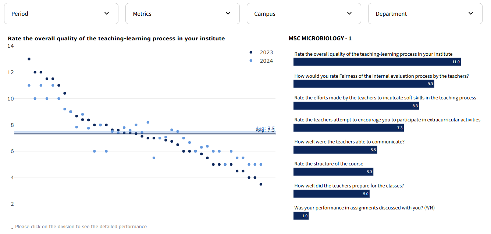

# Samba Soccer Schools Dashboard

The PoC Dashboard was developed using Streamlit to provide a dynamic and interactive platform for visualizing and analyzing performance metrics for different surveys.

## Features

- **Average Score Visualization**: The dashboard prominently displays the average score of specific metrics across all programs, providing a clear overview of overall performance.
- **Cross-Program Comparison**: Users can view and compare scores across different programs.
- **Deviation from Average**: It visualizes how far each program's performance deviates from the overall average, highlighting outliers and exceptional performers.
- **Historical Data Analysis**: The dashboard includes functionalities to compare current results against historical data, allowing users to track progress and trends over time.
- **Deep Dive Analytics**: Advanced filters and interactive charts enable users to delve deeper into the data, examining specific aspects of program performance in detail.

## Examples

Here are some practical examples of how to use the dashboard:

### Example 1: Viewing Performance by Class
1. Select the desired period from the "Period" filter.
2. Choose a metric from the "Metrics" dropdown.
3. Select the membership period and age group.
4. View the performance metrics for different classes in the scatter plot.
5. Click on a class to see detailed performance metrics for the selected class in the bar chart.




### Example 2: Viewing Performance by Age Group
1. Navigate to the "Performance by Age Group" tab.
2. Select the desired period from the "Period" filter.
3. Choose a metric from the "Metrics" dropdown.
4. Select the membership period and class.
5. View the performance metrics for different age groups in the column chart.
6. Click on an age group to see the top 10 performing classes in that age range in the bar chart.


## Installation

1. Clone the repository:
   ```sh
   git clone https://github.com/ninoperanidze/PoC_Dashboard.git
   cd PoC_Dashboard

2. Create and activate a virtual environment:
   ```sh
    python -m venv .venv
    .venv\Scripts\activate  # On Windows
    source .venv/bin/activate  # On macOS/Linux

3. Install the required packages:
   ```sh
    pip install -r requirements.txt

4. Run the Streamlit app:
   ```sh
    streamlit run app.py


## Requirements

- Python 3.11
- The required packages are listed in the `requirements.txt` file. They include:
  - `streamlit`
  - `pandas`
  - `plotly`
  - `streamlit-plotly-events`


## File Structure

- `app.py`: The main application file containing the Streamlit code and chart configurations.
- `data_cleaned.xlsx`: The dataset containing the performance metrics for Samba Soccer Schools.
- `requirements.txt`: The file listing the required packages for the project.
- `.streamlit/config.toml`: The configuration file for Streamlit settings.

## License

This project is licensed under the MIT License. See the LICENSE file for more details.
